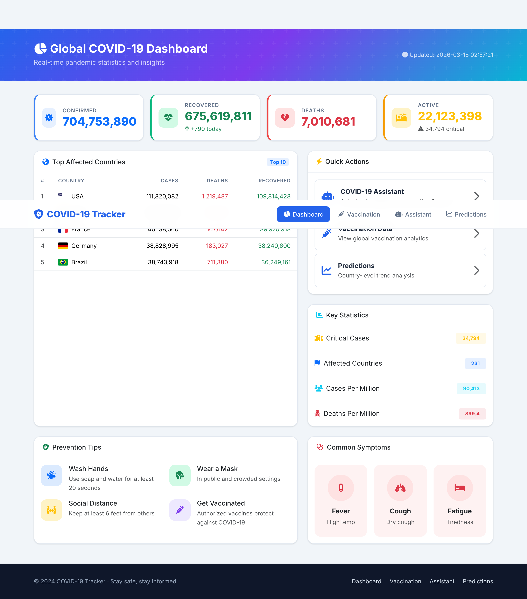
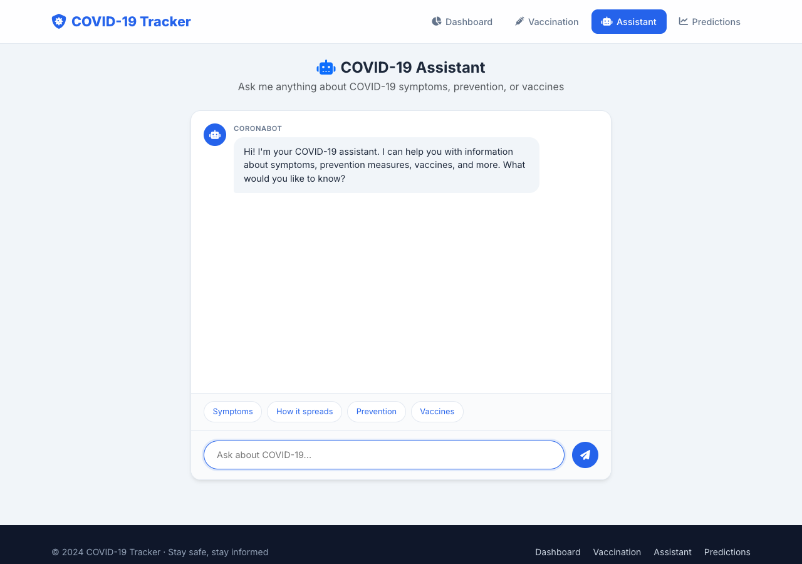
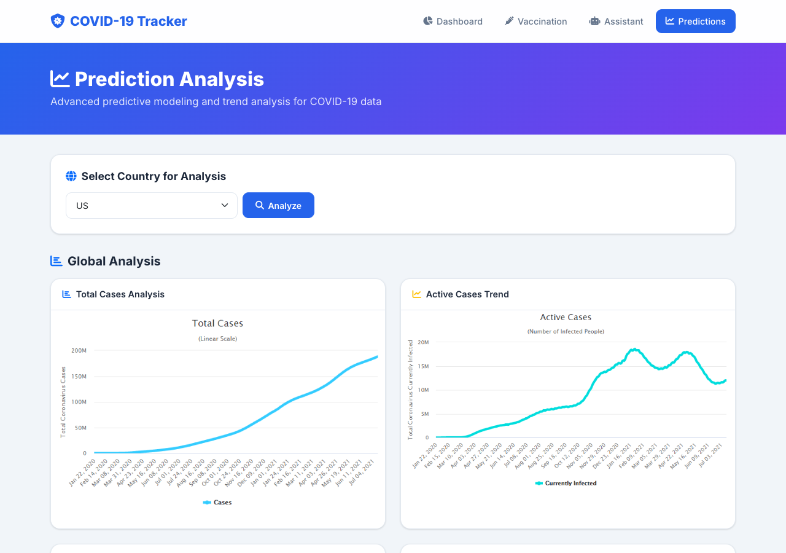
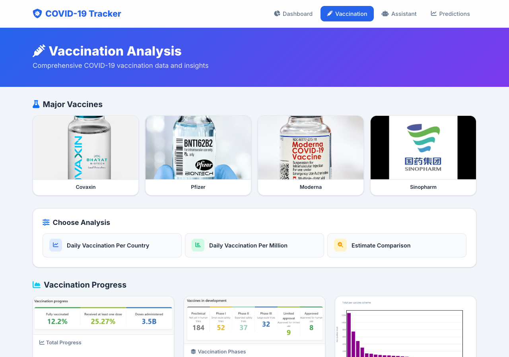

# COVID-19 Tracker

A modern, real-time COVID-19 dashboard built with Django featuring live global statistics, an AI-powered chatbot, country-level prediction analysis, and vaccination insights.

**Live Demo:** [covid19tracker-priyanshsinghal.vercel.app](https://covid19tracker-priyanshsinghal.vercel.app)

---

## Screenshots

### Dashboard
Real-time global statistics with top affected countries, key metrics, prevention tips, and quick navigation.



### COVID-19 Assistant
AI-powered chatbot using TF-IDF similarity matching against CDC FAQ data. Includes suggestion chips for quick questions.



### Prediction Analysis
Country-level trend analysis with total cases, active cases, cumulative cases, and death projections.



### Vaccination Analysis
Vaccination progress data with major vaccine brands, daily vaccination rates, and estimation comparisons.



---

## Features

- **Live Dashboard** - Real-time global COVID-19 statistics from the [disease.sh](https://disease.sh/) API with comma-formatted numbers, country flags, and key metrics
- **AI Chatbot** - Natural language Q&A powered by TF-IDF vectorization and cosine similarity against CDC FAQ data
- **Prediction Analysis** - Country-specific case prediction charts and trend analysis using Johns Hopkins CSSE data
- **Vaccination Insights** - Daily vaccination rates, per-million comparisons, progress tracking, and estimation analysis
- **Responsive Design** - Mobile-first layout with Bootstrap 5.3, works on all screen sizes
- **Accessible** - ARIA labels, skip navigation, keyboard-navigable, semantic HTML throughout

## Tech Stack

| Layer | Technology |
|-------|-----------|
| Backend | Python 3.9, Django 4.2 |
| Frontend | Bootstrap 5.3, Font Awesome 6.5, Google Fonts (Inter) |
| AI/ML | scikit-learn (TF-IDF, Cosine Similarity) |
| Data Sources | [disease.sh API](https://disease.sh/), [Johns Hopkins CSSE](https://github.com/CSSEGISandData/COVID-19) |
| Deployment | Vercel (Serverless Python) |
| Static Files | WhiteNoise |

## Project Structure

```
Covid-19/
├── covid/                    # Main Django app
│   ├── views.py              # All view functions (dashboard, chatbot, prediction, vaccination)
│   └── utils.py              # API fetching utilities
├── dashboard/                # Django project config
│   ├── settings.py           # Django settings
│   ├── urls.py               # URL routing
│   └── wsgi.py               # WSGI entry point (Vercel compatible)
├── template/                 # HTML templates
│   ├── base.html             # Base layout with navbar and footer
│   ├── dashboard.html        # Main dashboard
│   ├── chatbot.html          # AI assistant interface
│   ├── prediction.html       # Prediction analysis page
│   ├── vaccination.html      # Vaccination data page
│   └── 404.html              # Custom error page
├── static/img/               # Chart images and vaccine logos
├── cdc_qa.csv                # CDC FAQ dataset for chatbot
├── requirements.txt          # Python dependencies
├── vercel.json               # Vercel deployment config
└── manage.py                 # Django CLI
```

## Getting Started

### Prerequisites

- Python 3.9+
- pip

### Local Development

1. **Clone the repository**
   ```bash
   git clone https://github.com/priyansh18/Covid-19.git
   cd Covid-19
   ```

2. **Create and activate virtual environment**
   ```bash
   python3 -m venv venv
   source venv/bin/activate        # macOS/Linux
   venv\Scripts\activate           # Windows
   ```

3. **Install dependencies**
   ```bash
   pip install -r requirements.txt
   ```

4. **Run the development server**
   ```bash
   python manage.py runserver
   ```

5. **Open in browser**
   ```
   http://127.0.0.1:8000
   ```

### Deploy to Vercel

1. Install Vercel CLI: `npm i -g vercel`
2. Login: `vercel login`
3. Deploy: `vercel --prod`

The `vercel.json` is pre-configured for Django serverless deployment.

## API Endpoints

| Route | Method | Description |
|-------|--------|-------------|
| `/` | GET | Main dashboard with global stats |
| `/chatbot-page/` | GET | AI assistant interface |
| `/chatBot/` | POST | Chatbot API (returns JSON) |
| `/prediction/` | GET/POST | Prediction analysis with country selection |
| `/vaccination/` | GET/POST | Vaccination data and analysis |

## Data Sources

- **Real-time stats**: [disease.sh](https://disease.sh/v3/covid-19/all) - Global and country-level COVID-19 data
- **Historical data**: [Johns Hopkins CSSE](https://github.com/CSSEGISandData/COVID-19) - Time series confirmed cases
- **Chatbot knowledge**: CDC FAQ dataset (`cdc_qa.csv`) with TF-IDF matching

## License

This project is open source and available under the [MIT License](LICENSE).

---

Built by [Priyansh Singhal](https://priyanshsinghal.vercel.app), Daksh Trehan & Abhishek Jaglan
